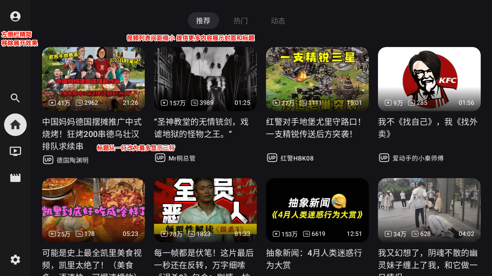

# BV
## Best Video

# 该改版是给带键鼠的安卓设备使用的，严禁tv端使用，若有tv端使用者，请在24小时内删除否则后果自负,若有tv端使用需求，请下载官方小电视！

---
BV 是一款 [哔哩哔哩](https://www.bilibili.com) 的第三方 `Android` 应用，使用 `Jetpack Compose` 开发。
首先致敬一下原作者，对其持之以恒的更新保持respect🫡。
本项目也会持续合入作者的更新，以及不断加入我自己的定制修改

# 修改
主要在原bv的基础上做了一些符合我个人喜好的修改，包括：

### 已经完成的（Done✅）

1. #### 移除首页左侧的抽屉展开效果，避免频繁展开收起，以及占用右侧信息流空间
    移除抽屉效果很简单，但为了让移除后左侧栏的各个入口焦点和右侧内容要完全绑定上，花了不短的时间去调试修改。
最终还通过了一些奇技淫巧来让焦点变换更加符合直觉，上下左右都让焦点跳到应该到的位置。
除此以外还有一些小的优化，比如内容页按下返回键会回到左侧栏而不是进入退出APP流程，缩短双击退出的判断时长等
2. #### 回到左侧栏后再回到内容页，会恢复上次已选中的Tab位置
3. #### 视频标题从只显示1行改为3行、缩减视频列表的各种间距已提供更多内容显示封面和标题
4. #### 标题下方显示发布时间（动态列表显示x时间前，其它列表显示具体时间）
5. #### 设置页不再作为单独页面独立打开（本意是为了解决跳转不到设置入口而改的，但问题原因不在这里，这个改动还是保留了）
6. #### 移除 ugc、pgc 页面的轮播组件，避免抢占焦点导致无法跳到设置页的问题（应该也没什么人看轮播内容把）（Thanksfor@TangYanxin）
7. #### 首页 Tab 新增个人页（包含历史、收藏、稍后再看、追番），设置页中增加首页 Tab 顺序调整功能

### 待处理的Todo
1. 播放页进度条展示优化，现在的太大有点影响视频画面
2. 点击封面直接播放视频而不是跳转信息页
3. 调整播放时上下左右呼出的内容，主要配合第一点，不展示详情页后需要给出详情页入口
4. 优化各种case下优化返回键逻辑，比如拉起进度条时返回是关闭进度条而不是关闭播放页
5. 左右拖动后立刻快进快退不需要再点确认

### 一些想法的Todo
1. 播放页和详情页增加点赞、投币、一键三连入口，支持Up创作，不知道作者为什么没加
2. 视频封面标题下方增加发布时间，就像 BBLL 那样（目前接口里好像没这个信息，得看看怎么加）
3. 动态列表增加按时间轴跳转（比如按天快速跳，方便从几天前开始追更），或者支持一键跳到上次看到的时间段（可能难度比较大）
4. 增加快捷调整倍速播放，现在的调整路径有点长

### 性能优化
目前只对一些动画做了优化

# 安装
### [Release](https://github.com/Leelion96/bv/releases)

# License
[MIT](LICENSE) © aaa1115910